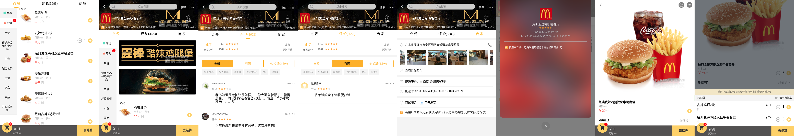

# vue-meituan

## 本地效果预览

```
    clone git@github.com:tornoda/vue-meituan.git
    npm install
    npm run serve
```

## 截图查看



## 使用技术栈

1. 前端框架：vue
2. 路由：vue-rounter
3. 状态管理：vuex
4. ajax请求处理：axios
5. 滚动处理方案：better-scroll
6. 图片懒加载：vue-lazyload
7. 异步数据：vuecli3.0 proxy
8. 未使用前端ui框架
9. 可复用组件开发

## 实现功能简介

### 点菜页面

1. 嵌套滚动
2. 分类与分类详情级联滚动（并对业务逻辑做了性能优化）
3. 增加和删除商品（联动）

### 评价页面

1. 评价星级自动计算
2. 评论筛选
3. 展示

### 商家页面

1. 展示

### 详情页面

1. 评论组件化
2. 增加与删除商品（联动）

### 购物车

1. 购物车商品展示
2. 增加与删除商品（联动）

### 动画

1. 进入商品详情时，点菜页面与详情页并排左移动（模拟原始app动画），返回时相反
2. 购物车进入与退出的推拉动画，背景淡入淡出
3. 其他次要动画